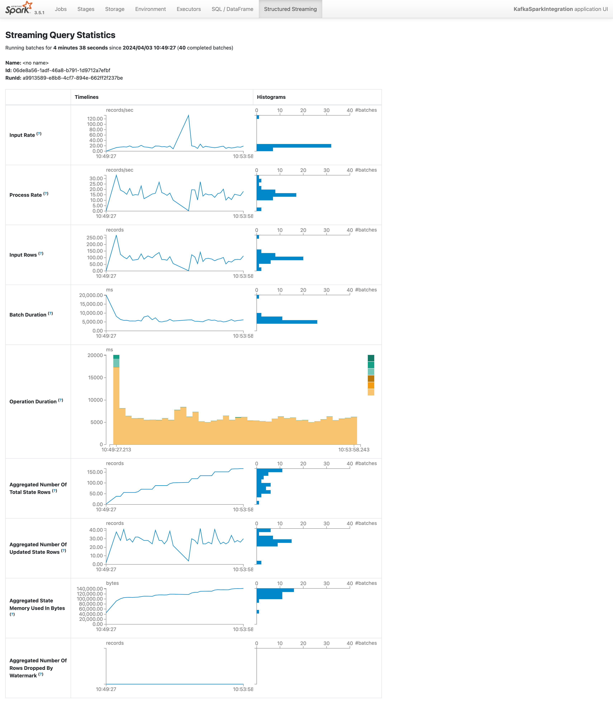
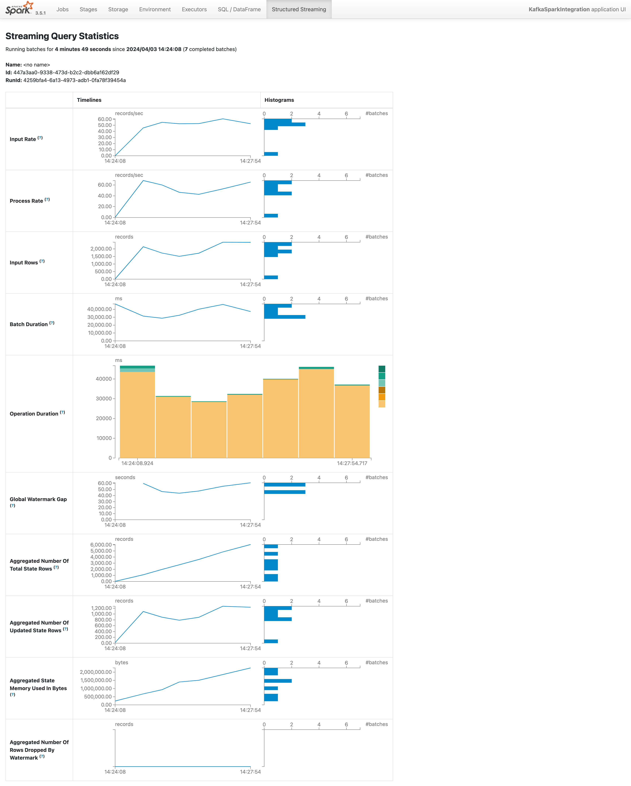

Prepare for docker compose-------To build images for hdfs

In root dir: docker build -t hadoop:base .

In hdfs-namenode: docker build -t hadoop:namenode .

In hdfs-datanode: docker build -t hadoop:datanode .


Run the docker compose:

docker compose up --scale spark-worker=3 -d

On namenode Run : hdfs dfs -put /data/data.csv /data.csv

To enable anyone to write and access, on hadoop namenode run: hdfs dfs -chmod 777 /

On Spark master Run : 

  pip3 install numpy pandas matplotlib requests; bin/spark-submit --master spark://spark-master:7077 /opt/spark-apps/k-means.py

To save the file to hdfs, on spark master run:

  python3 /opt/spark-apps/save.py

To view the saved file:

For docker network, i have not find a good way to view file on host locally, because files are on datanode, when localhost request resouce from hdfs, Namenode server will send the datanode dns name to localhost, and redirect host to a path on the dns name, but host machine can't resolve it. So the way is to use VSC to "attach to running container", then curl the file with(I want to see the result image, here is a demo):

curl -L "http://localhost:9870/webhdfs/v1/kmeans_clusters.png?op=OPEN" -o kmeans_clusters.png

And open the file in VSC


### Connect to Kafka

- run above docker compose to start spark

- git clone realtime-data-analysis repo

```
git clone https://github.com/cs6675-spring24-group13/realtime-data-analysis.git
```

- run docker compose at above repo's root dir

```
docker compose up -d
```


- in spark master, run program below. kafka-connect.py is a sample program that basically stdout the kafka's event only

```
bin/spark-submit --packages org.apache.spark:spark-sql-kafka-0-10_2.12:3.1.1 --master spark://spark-master:7077 /opt/spark-apps/kafka-connect.py
```

- sample kafka event data (every line is a new event)

```
{"exchange":"HITBTC","symbol":"XLM-USDT","bid":0.11924,"ask":0.119283,"timestamp":1709146868.173,"receipt_timestamp":1709146868.180787}
{"exchange":"HITBTC","symbol":"XLM-USDT","bid":0.11924,"ask":0.119288,"timestamp":1709146868.373,"receipt_timestamp":1709146868.397893}
{"exchange":"HITBTC","symbol":"XLM-USDT","bid":0.119247,"ask":0.119288,"timestamp":1709146868.574,"receipt_timestamp":1709146868.5954921}
{"exchange":"HITBTC","symbol":"XLM-USDT","bid":0.119247,"ask":0.119283,"timestamp":1709146868.974,"receipt_timestamp":1709146869.012954}
{"exchange":"HITBTC","symbol":"XLM-USDT","bid":0.119247,"ask":0.119288,"timestamp":1709146869.374,"receipt_timestamp":1709146869.4037209}
{"exchange":"HITBTC","symbol":"XLM-USDT","bid":0.119247,"ask":0.119283,"timestamp":1709146869.975,"receipt_timestamp":1709146870.0044413}
{"exchange":"HITBTC","symbol":"XLM-USDT","bid":0.119247,"ask":0.119288,"timestamp":1709146870.376,"receipt_timestamp":1709146870.409218}
{"exchange":"HITBTC","symbol":"XLM-USDT","bid":0.119247,"ask":0.119288,"timestamp":1709146870.676,"receipt_timestamp":1709146870.872053}
{"exchange":"HITBTC","symbol":"XLM-USDT","bid":0.119247,"ask":0.119283,"timestamp":1709146870.776,"receipt_timestamp":1709146870.87225}
{"exchange":"HITBTC","symbol":"XLM-USDT","bid":0.119247,"ask":0.119288,"timestamp":1709146871.077,"receipt_timestamp":1709146871.4190223}
{"exchange":"HITBTC","symbol":"XLM-USDT","bid":0.119252,"ask":0.119288,"timestamp":1709146872.078,"receipt_timestamp":1709146872.2285795}
{"exchange":"HITBTC","symbol":"XLM-USDT","bid":0.119288,"ask":0.119306,"timestamp":1709146872.579,"receipt_timestamp":1709146872.6436334}
{"exchange":"HITBTC","symbol":"XLM-USDT","bid":0.119291,"ask":0.119306,"timestamp":1709146872.779,"receipt_timestamp":1709146872.78021}
{"exchange":"HITBTC","symbol":"XLM-USDT","bid":0.119295,"ask":0.119347,"timestamp":1709146873.58,"receipt_timestamp":1709146873.587899}
{"exchange":"HITBTC","symbol":"XLM-USDT","bid":0.119312,"ask":0.119347,"timestamp":1709146873.881,"receipt_timestamp":1709146874.0210495}
```

### Run with metrics exposed (Optional)

bin/spark-submit --packages org.apache.spark:spark-sql-kafka-0-10_2.12:3.1.1 \
--master spark://spark-master:7077 /opt/spark-apps/kafka-connect.py \
--conf spark.ui.prometheus.enabled=true \
--conf spark.executor.processTreeMetrics.enabled=true

You can access the prometheus metrics datapoint at 

- [Spark Master](http://localhost:8080/metrics/master/prometheus/)
- [Spark Worker](http://localhost:8081/metrics/prometheus/)
- [Spark Exector](http://localhost:4040/metrics/prometheus/)

### Run with complex jobs

### Run with avg, max, min of bid and ask per 30 seconds

- command

```
bin/spark-submit --packages org.apache.spark:spark-sql-kafka-0-10_2.12:3.1.1 \
--master spark://spark-master:7077 /opt/spark-apps/kafka-spark-streaming-sample.py \
--conf spark.ui.prometheus.enabled=true \
--conf spark.executor.processTreeMetrics.enabled=true
```

- sample output

```
+------------------------------------------+--------+---------------------+---------------------+----------+-----------+----------------+
|window                                    |symbol  |avg_bid              |avg_ask              |max_bid   |min_ask    |last_timestamp  |
+------------------------------------------+--------+---------------------+---------------------+----------+-----------+----------------+
|{2024-04-03 10:49:30, 2024-04-03 10:50:30}|BTC-USD |66109.14407407408    |66166.80462962961    |66125.42  |66143.46   |1.712141413595E9|
|{2024-04-03 10:49:30, 2024-04-03 10:50:30}|LTC-BTC |0.0015151384615384616|0.0015161153846153844|0.0015159 |0.001516   |1.712141409189E9|
|{2024-04-03 10:49:30, 2024-04-03 10:50:30}|BTC-USDC|66136.51578970588    |66143.17441588234    |66152.5922|66119.2058 |1.712141411793E9|
|{2024-04-03 10:50:00, 2024-04-03 10:51:00}|XRP-USD |0.5867803333333332   |0.5879889999999999   |0.586872  |0.587845   |1.712141410191E9|
|{2024-04-03 10:50:00, 2024-04-03 10:51:00}|BTC-USD |66113.50608695652    |66173.78782608695    |66125.42  |66162.4    |1.712141413595E9|
|{2024-04-03 10:50:00, 2024-04-03 10:51:00}|ETH-BTC |0.050134625          |0.0501465            |0.050137  |0.050141   |1.71214140959E9 |
|{2024-04-03 10:50:00, 2024-04-03 10:51:00}|BCH-USDT|605.35748            |605.54632            |605.561   |605.231    |1.712141413795E9|
|{2024-04-03 10:50:00, 2024-04-03 10:51:00}|XRP-USDT|0.5869194545454545   |0.5870497272727273   |0.586995  |0.58693    |1.712141411192E9|
|{2024-04-03 10:49:30, 2024-04-03 10:50:30}|XRP-USDT|0.5867660204081633   |0.5868905102040817   |0.586995  |0.58653    |1.712141411192E9|
|{2024-04-03 10:49:30, 2024-04-03 10:50:30}|ETH-USDT|3313.805633333334    |3314.3617999999997   |3315.268  |3311.842   |1.712141412994E9|
|{2024-04-03 10:49:30, 2024-04-03 10:50:30}|ADA-USDT|0.5875976027777778   |0.5877651180555556   |0.5878988 |0.5874294  |1.712141413195E9|
|{2024-04-03 10:50:00, 2024-04-03 10:51:00}|ADA-USDT|0.587752144          |0.587903892          |0.5878988 |0.5877294  |1.712141413195E9|
|{2024-04-03 10:49:30, 2024-04-03 10:50:30}|XRP-USD |0.586612875          |0.5878067083333333   |0.586872  |0.587567   |1.712141410191E9|
|{2024-04-03 10:50:00, 2024-04-03 10:51:00}|LTC-BTC |0.00151552           |0.0015162600000000002|0.0015159 |0.001516   |1.712141409189E9|
|{2024-04-03 10:50:00, 2024-04-03 10:51:00}|LTC-USDT|100.18887894736841   |100.20623684210527   |100.2265  |100.1701   |1.712141413595E9|
|{2024-04-03 10:49:30, 2024-04-03 10:50:30}|EOS-USDT|0.9766214285714286   |0.976712976190476    |0.97729   |0.9761     |1.712141413395E9|
|{2024-04-03 10:50:00, 2024-04-03 10:51:00}|BTC-USDC|66140.86742          |66147.44968230769    |66152.5922|66135.50661|1.712141411793E9|
|{2024-04-03 10:49:30, 2024-04-03 10:50:30}|LTC-USDT|100.16263492063491   |100.17974761904762   |100.2265  |100.1201   |1.712141413595E9|
|{2024-04-03 10:50:00, 2024-04-03 10:51:00}|USDT-USD|1.0002991666666665   |1.001008333333333    |1.00043   |1.00086    |1.712141412294E9|
|{2024-04-03 10:50:00, 2024-04-03 10:51:00}|ETH-USD |3313.4767999999995   |3318.936             |3314.51   |3318.936   |1.71214140999E9 |
+------------------------------------------+--------+---------------------+---------------------+----------+-----------+----------------+
```

- sample metrics graph




### Run with sample trading strategy based on ave

- command

```
bin/spark-submit --packages org.apache.spark:spark-sql-kafka-0-10_2.12:3.1.1 \
--master spark://spark-master:7077 /opt/spark-apps/kafka-spark-streaming-trading-sample.py \
--conf spark.ui.prometheus.enabled=true \
--conf spark.executor.processTreeMetrics.enabled=true
```

- sample output

```
+--------------------------+--------+-----------+-----------------+------+
|receipt_timestamp         |symbol  |bid        |avg_price        |signal|
+--------------------------+--------+-----------+-----------------+------+
|2024-04-03 14:24:10.656967|BTC-USDC|66604.56959|66603.74484714287|BUY   |
|2024-04-03 14:24:10.85317 |BTC-USDC|66612.56919|66603.74484714287|BUY   |
|2024-04-03 14:24:11.054794|BTC-USDC|66612.56919|66603.74484714287|BUY   |
|2024-04-03 14:24:11.24949 |BTC-USDC|66612.56919|66603.74484714287|BUY   |
|2024-04-03 14:24:13.251854|BTC-USDC|66623.80124|66603.74484714287|BUY   |
|2024-04-03 14:24:13.851301|BTC-USDC|66623.80124|66603.74484714287|BUY   |
|2024-04-03 14:24:14.055478|BTC-USDC|66620.56879|66603.74484714287|BUY   |
|2024-04-03 14:24:14.249537|BTC-USDC|66620.56879|66603.74484714287|BUY   |
|2024-04-03 14:24:14.450786|BTC-USDC|66620.80846|66603.74484714287|BUY   |
|2024-04-03 14:24:15.2473  |BTC-USDC|66620.56879|66603.74484714287|BUY   |
|2024-04-03 14:24:15.64594 |BTC-USDC|66620.59964|66603.74484714287|BUY   |
|2024-04-03 14:24:15.848139|BTC-USDC|66620.56879|66603.74484714287|BUY   |
|2024-04-03 14:24:16.252323|BTC-USDC|66620.57703|66603.74484714287|BUY   |
|2024-04-03 14:24:16.645879|BTC-USDC|66620.56879|66603.74484714287|BUY   |
|2024-04-03 14:24:17.247098|BTC-USDC|66620.78636|66603.74484714287|BUY   |
|2024-04-03 14:24:17.448503|BTC-USDC|66620.56879|66603.74484714287|BUY   |
|2024-04-03 14:24:18.248591|BTC-USDC|66620.69458|66603.74484714287|BUY   |
|2024-04-03 14:24:19.047168|BTC-USDC|66620.69458|66603.74484714287|BUY   |
|2024-04-03 14:24:19.447797|BTC-USDC|66620.69458|66603.74484714287|BUY   |
|2024-04-03 14:24:21.45168 |BTC-USDC|66620.56879|66603.74484714287|BUY   |
+--------------------------+--------+-----------+-----------------+------+
```

- sample metrics graph

